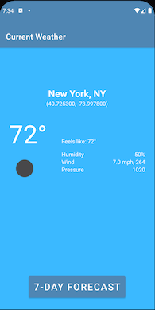
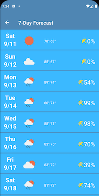

# Brian Cooley's Implementation of the One Drop Android Coding Challenge

# Explanation of Architecture
The app is a single activity app with two fragments. One fragment (the home fragment) displays the current weather, while a second fragment displays the 7-day forecast.

There is a single ViewModel that acts as a lifecycle-aware store for the Activity. This allows the Fragments to share the data retrieved by the API call. Since the call returns both current data and the forecast, this minimizes the number of calls.

The ViewModel uses the Retrofit 2 WeatherApi. It is a direct call to the service. In a more complex app, we might add another layer so that the network calls could be store in local storage, such as a Room database. This layer is typically referred to as a Repository  (for example, in Google's Android documentation).

The app uses the Jetpack Navigation framework for transitions between fragments

# Screenshots
 

# Future Work 
* Better error message handling than Toast
* Images for weather (Clear/Partly Cloudy/etc.)
* Graph for forecast
* Add repository and database/file storage for offline use
* Provide common cities as options using a HashMap that has keys that are city names and values of Lat/Long
* Use location to fetch weather
* Check for network status
* More Unit tests
* UI tests
* Improved design
